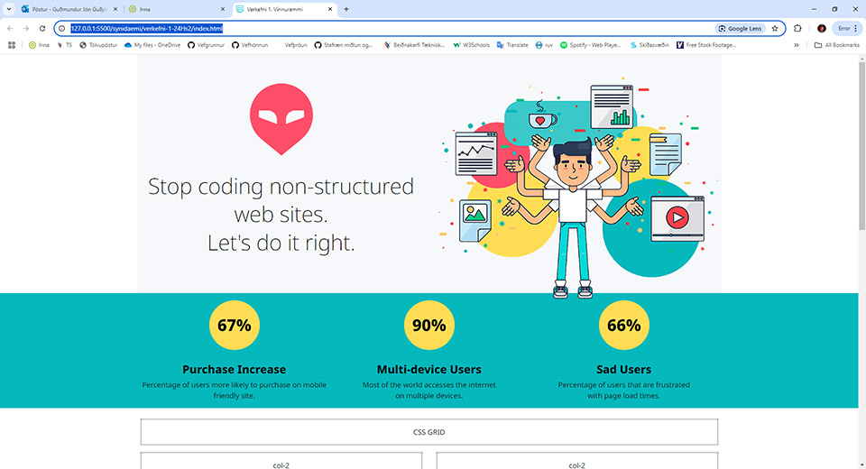
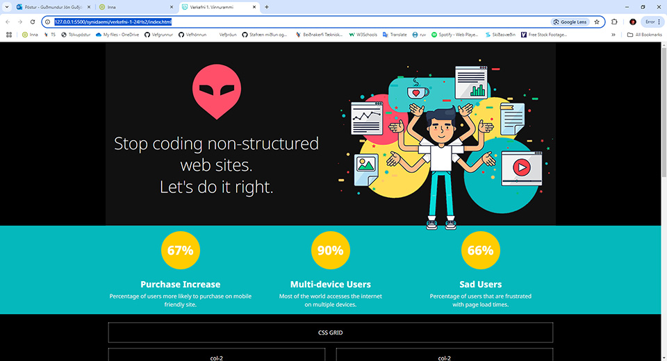
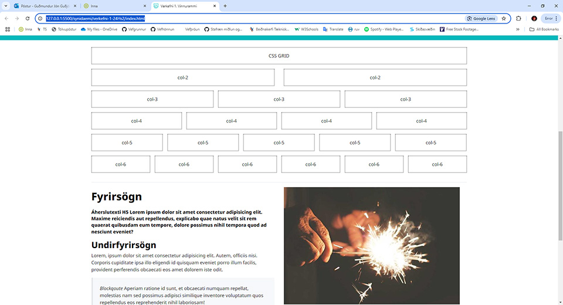
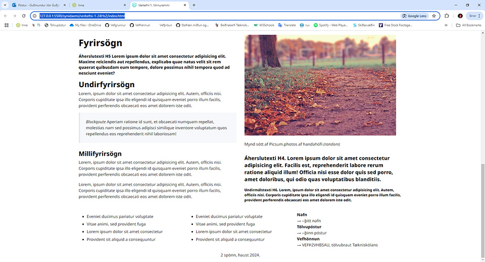
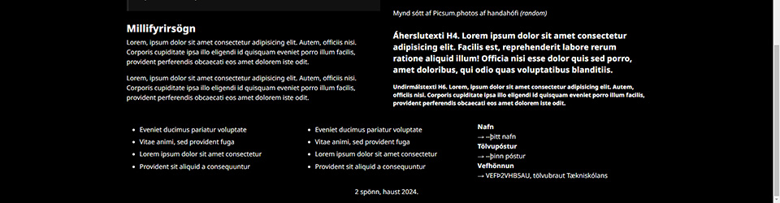
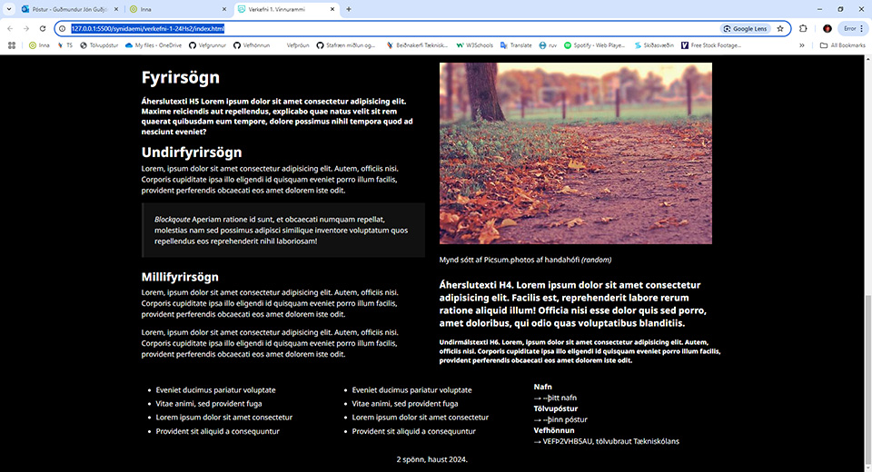

# CSS grunnsíða - _CSS boilerplate_

### Markmið:
Nemendur öðlast skilning á skipulagningu stílsíðukerfis og á hönnun CSS grunnsíðu (_Boilerplate_)  til að hanna betri vefsíður.

Þegar komið er að því að hanna vef með skipulögðum hætti er gott að geta stuðst við grunnkerfi þar sem búið er að hanna alla grunnþætti sem nota þarf í vef. Þar má nefna grindakerfi, sveigjanlega hönnun, litaval og leturnotkun. 

Meðfylgjandi verkefninu er HTML og CSS grunnsíða sem þú getur notað til að búa til þitt eigið grunnsíðukerfi. Vefurinn á að sýna skipulag og útlit vefsins. 

* [Grunnsíður - Boilerplate](Námsefni-1/boilerplate/)
* [New.css](https://github.com/xz/new.css)

### Tvískipt litaþema

### Grid dálkakerfi

### Námsmat:  

#### Æfingaverkefni 5%

* Skipulag – Layout				
  * 2% Dálkaskipulag - Grid 
  *	1% Myndir aðlagast skjástærðum
* Útlit					
  * 2% CSS breytur - Litasamsetning
  * 1% Leturval - leturnotkun	

Vefsíðu og stílsíðu er skilað í _Innu/VEFÞ1VG/Verkefni-1_ í þjappaðri skrá, **Æfingar.zip**. 

#### Einkunn verður birt í Innu
