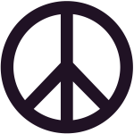

# Hugmyndavinna

Eins og fram kemur í verklýsingu er _efnisval frjálst_, gott er að byrja snemma að finna hugmynd að lokaverkefninu. 

Hér er grunnur til að byrja á. Breytið og bætið að eigin smekk. _Gerið svo vel._

---

## Hátíð ljóssins á vetrarsóstöðum

### Tónleikar á (... stöðum) þar sem þekktir tónlistarmenn koma fram

Efnisyfirlit, hvað þarf að koma fram á vefnum

1. Hversvegna
1. Hverjir koma fram
1. Hvar
1. Hvenær, dagskrá
1. Skráning á viðburði
1. Hverjir sjá um hátíðina

---

1. Á vetrarsólstöðum ...

2. Á tónleikunum koma fram ...

3. Hvar eru hverjir?

4. Föstudagur 20. desember
    * Kl. 13.30: Hátíðin sett þegar sól er hæst á lofti. 
    * Kl. 15.30: .............................
    * Kl. 17.30: .............................
    * Kl. 18.30: ..............................
    * Kl. 19.00: ..............................
    * Kl. 20.30: ..............................
    * Kl. 22.00: ..............................
    * Kl. 23.59: Lifandi tónlist á ............

5. Skráning á viðburði

6. Hafðu samband - hverjir erum við?

---

### [Dæmi um lokaverkefni unnin í VEFÞ2VH](https://vefhonnun.github.io/synidaemi/)

